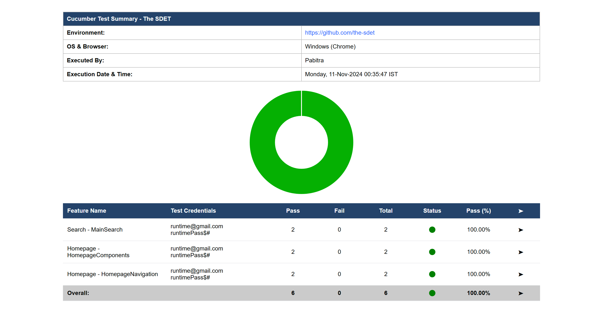
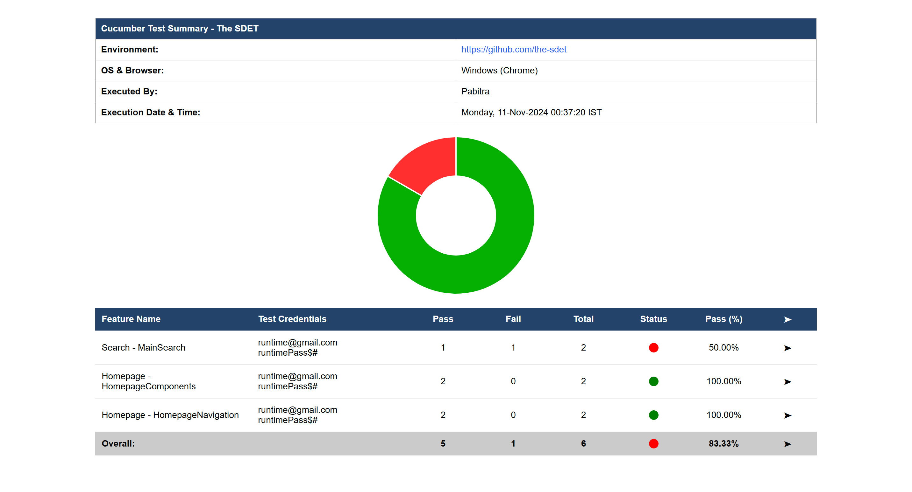
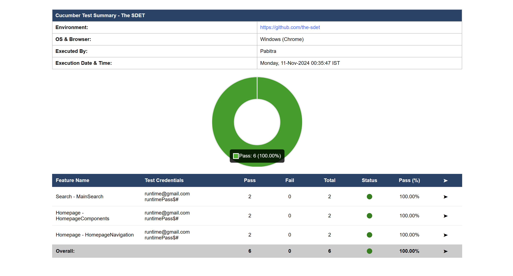
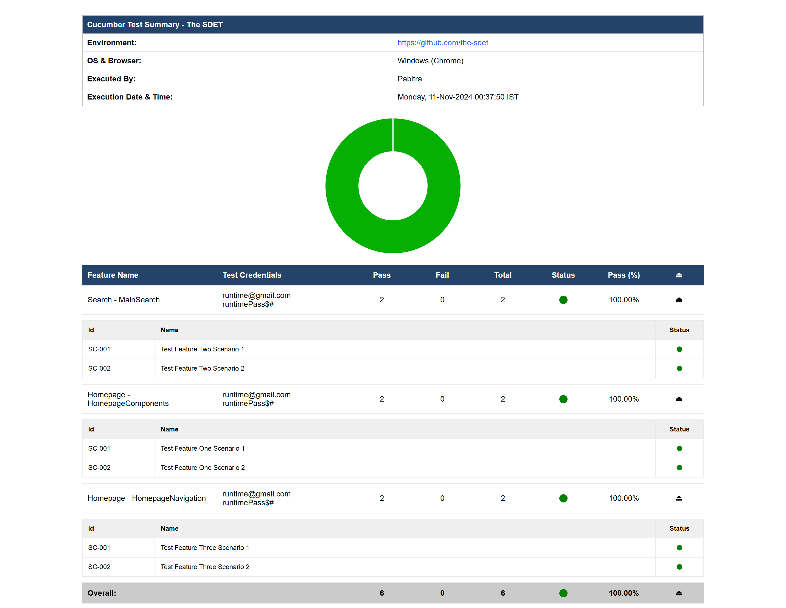
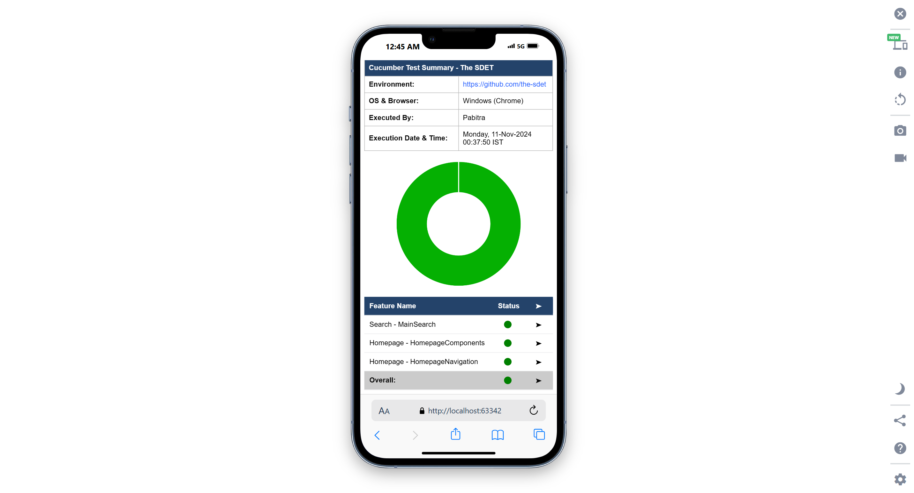

# Cucumber Summary Reporter

[](https://search.maven.org/artifact/io.github.the-sdet/cucumber-summary-reporter)
[](https://javadoc.io/doc/io.github.the-sdet/cucumber-summary-reporter)

## A Simple Library that generates a Cucumber Test Summary

This library generates a summary report for Cucumber test results, which can be integrated as a plugin/adapter for Cucumber. The report provides a concise overview of test execution, making it easier to analyze test stats or distribute a simplified summary, for example, via email.

### Cucumber Summary Report — All Pass


### Cucumber Summary Report — Mixed Result


### Cucumber Summary Report — Hover On Doughnut to see details



### Cucumber Summary Report Extended


### Cucumber Summary Report — Mobile View


## Features
* Generates a quick summary of Cucumber test results.
* Doughnut Chart gives a visual representation of an Overall result
* Provides statistics on test runs, including total, passed, failed scenarios.
* Supports output formats suitable for presentations or email reports.
* Easy integration as a Cucumber plugin/adapter.
* Optimised for Desktop, Tablet and Mobile View

## Usage

Cucumber Summary Reporter requires Cucumber 7 or newer.

To use Cucumber Summary Reporter, add the following dependency to your Maven project:

```xml

<dependency>
    <groupId>io.github.the-sdet</groupId>
    <artifactId>cucumber-summary-reporter</artifactId>
    <version>1.0.7</version>
</dependency>
```

After adding the dependency, use `io.github.the_sdet.adapter.CucumberSummaryReporter:` as plugin for Cucumber test runner.

If you are using JUnit4, you might need to add it under @CucumberOptions and plugin like below
```java
@RunWith(Cucumber.class)
@CucumberOptions(
features = "src/test/resources/features", glue = {"stepdefinitions", "hooks"},
plugin = {"pretty", "html:testReports/CucumberReport.html", "io.github.the_sdet.adapter.CucumberSummaryReporter:"},
tags = "not @ignore"
)
public class TestRunner {

}
```
Or if you are using JUnit5, you might need to add this property to your `junit-platform.properties`

`cucumber.plugin=pretty, html:testReports/CucumberReport.html, io.github.the_sdet.adapter.CucumberSummaryReporter:`

### Configs
By Default, the report will show only Report title and Execution Timestamp as metadata along with the results.

Other info like Environment, OS & Browser, Executed By won't appear by default but can be configured.

For the configuration, create a file named `cucumber-summary.properties` inside `test/resources`.

Below are the Properties that can be defined for the report configuration 
```properties
report.title=Cucumber Test Summary — The SDET

show.env=true
env.url=https://github.com/the-sdet

show.os.browser=true
os.browser=Windows (Chrome)

show.executed.by=true
executed.by=Pabitra

report.file.path=testReports/CucumberSummary.html

# in case the features are present under some additional folders under features folder,
# and you want that folder name to be added as prefix with the feature file name for better readability
# E.g., if Homepage is the folder; Components, Navigation are features, then
# when true it will appear like Homepage - Components, Homepage - Navigation and when false Components and Navigation
use.package.name=true

# in case you want to use the feature name defined inside the feature file to appear in the report instead of file name
# E.g., if the file name is Homepage.feature and the feature name inside the file is 'Homepage Tests'
# when true, the report will display Homepage Tests and Homepage when false
use.feature.name.from.feature.file=false

# These are the test user will be used in the report if 'Map<String, List<String>> testUsers' is NOT set.
# These can be set at the runtime from the before or after hook like below
# @After
# public void afterTest(Scenario scenario) {
#    testUsers.put(String.valueOf(scenario.getUri()), Arrays.asList("username, "password"));
# }
test.user=contact.the.sdet@gmail.com
test.password=CucumberSummary@123

show.execution.timestamp=true
time.stamp.format=EEEE, dd-MMM-yyyy HH:mm:ss z
time.zone=IST

#The Default desktop view is set to 80% width. You can change it with the below property
desktop.view.width=100%

heading.background.color=#23436a
heading.color=#ffffff

subtotal.background.color=#03455b
subtotal.color=#ffffff

scenario.table.heading.background.color=#efefef
scenario.table.heading.color=#000000
```

### Default Configs
* The Report title will appear as `Cucumber Test Summary`
* Report Location will be - `testReports/CucumberTestSummary.html`
* Timestamp format will be - `EEEE, dd-MMM-yyyy HH:mm:ss z`
* Timezone for the timestamp will be `IST`
* Heading Background color will be - `#23436a`
* And Subtotal Background Color will be - `#ffffff`
* Heading Background color will be - `#23436a`
* And Subtotal Background Color will be - `#ffffff`
* Scenario table Background color will be - `#efefef`
* And Subtotal Background Color will be - `#090909`

## Override Properties at Runtime
Sometimes, we need to update values from runtime, E.g., depending on env,
we use different URLs and that might NOT be possible to provide it properly in the properties file itself.
Right???
That's sorted.
Replace the * in the below command with the expected property key, and it works like charm.

```code
System.setProperty("cucumber.summary.*","new_value");
```
## Need Summary Data for some additional logging or reporting purposes?
You can use the below code in your afterAll hook and get those details.
```java
SummaryData summaryData = CucumberSummaryReporter.getSummaryData();
Map<String, Map<String, Status>> results = summaryData.results;
```
## Example of Usage
An Example of Usage of the Library can be found here: https://github.com/pabitra-qa/UsingCucumberSummaryReporter

## Authors

<a href="https://github.com/the-sdet"></a>
[@the-sdet](https://github.com/the-sdet)

<a href="https://github.com/the-sdet"></a>
[@pabitra-qa](https://github.com/pabitra-qa)

## 🚀 About Me

I'm a dedicated and passionate Software Development Engineer in Test (SDET) trying to help the community in focusing on 
building great automation frameworks rather than writing the same utilities again and again and again...

## Connect With Me

<a href="https://linkedin.com/in/pswain7"></a>
&nbsp; <a href="https://pabitra-qa.github.io/"></a>

## Feedback

If you have any feedback, please reach out to us at [contact.the.sdet@gmail.com](mailto:contact.the.sdet@gmail.com).

[//]: # ()